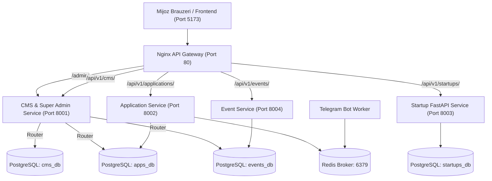

# UzCombinator NavDU — Loyihada Amalga Oshirilgan Ishlar Tarixi (Project History)

Ushbu hujjat **NavDU Inkubatsiya va Akseleratsiya Markazi (UzCombinator)** platformasi doirasida amalga oshirilgan barcha dasturiy, arxitekturaviy va vizual o‘zgarishlarning to‘liq xronologik solnomasi va texnik registridir.

---

## 1. Loyiha Arxitekturasi va Infratuzilma Xaritasi

Platforma mikroxizmatlar (microservices) arxitekturasida tashkil qilingan bo‘lib, barcha qismlar Docker konteynerlarida mustaqil va uzluksiz ishlaydi.



---

## 2. Xronologik Rivojlanish Tarixi (Changelog)

### [1.0.0] — Mikroxizmatlar va Docker Infratuzilmasini Sozlash
- **8 ta Docker konteyner** to‘liq sozlandi va ishga tushirildi:
  1. `uzc-api-gateway` (Nginx, port: `80:80`)
  2. `uzc-cms-service` (Django 5.1, port: `8001:8001`)
  3. `uzc-app-service` (Django 5.1, port: `8002:8002`)
  4. `uzc-startup-service` (FastAPI, port: `8003:8003`)
  5. `uzc-event-service` (Django 5.1, port: `8004:8004`)
  6. `uzc-bot-worker` (Aiogram/Redis Telegram bot ishchisi)
  7. `uzc-postgres-db` (PostgreSQL 16, port: `5432:5432`)
  8. `uzc-redis-broker` (Redis 7, port: `6379:6379`)
- Nginx Gateway orqali yagona domen orqali marshrutlash (`proxy_pass`) ta’minlandi.
- Superuser yaratildi: `admin` / `admin123`.

---

### [1.1.0] — Frontend va Backend Integratsiyasi hamda Tozalash
- Vite + React + TypeScript dasturi backend API lari bilan ulandi.
- Dastlabki sinov uchun kiritilgan keraksiz demo/placeholder ma’lumotlar tozalandi.
- Backenddan ma’lumotlarni bir martalik to‘liq yuklovchi **Server-Driven UI (`/api/v1/cms/layout/`)** API si joriy qilindi.
- `npm run build` tekshiruvi o‘tkazildi va 100% xatosiz kompilyatsiya holatiga keltirildi.

---

### [1.2.0] — Markazlashgan Super Admin va Multi-Database Router
- **Muammo:** Boshqaruv panelida faqat ikkita model (Users va Groups) ko‘rinib, qolgan servislar (Arizalar, Tadbirlar, Startaplar) yo‘qolib qolgan edi.
- **Yechim:**
  - `cms_service`, `application_service` va `event_service` dagi barcha modellar yagona super admin boshqaruviga jamlandi.
  - Maxsus `MultiServiceRouter` (`config/db_router.py`) yaratildi:
    - `applications` appi $\rightarrow$ `apps_db` bazasiga yo‘naltirildi.
    - `events` appi $\rightarrow$ `events_db` bazasiga yo‘naltirildi.
    - `layout` va `auth` $\rightarrow$ `cms_db` (default) bazasiga yo‘naltirildi.
  - Endi Super Admin `http://localhost/admin/` orqali 3 ta alohida PostgreSQL bazasidagi barcha 11 ta modelni bir joyda tahrirlay oladi.

---

### [1.3.0] — Django Jazzmin zamonaviy Admin UI va HTML Dizayn
- Standart eski Django admin interfeysi o‘rniga **`django-jazzmin`** o‘rnatildi.
- **Brending:** `UzCombinator NavDU`, zamonaviy Flatly mavzusi, qorong‘u/yorug‘ rejimlar.
- **Top Navigation:** Bosh sahifa, Arizalar, Hakatonlar, Startaplar tugmalari va global qidiruv paneli joylashtirildi.
- **Ikonkalar:** Barcha 17 ta model uchun mos FontAwesome 5 piktogrammalari ulandi.
- **HTML Badge ishlovlari:**
  - Arizalar holati (🟡 Kutilmoqda, 🟣 Suhbat, 🟢 Qabul qilindi, 🔴 Rad etildi).
  - Telefon va Telegram uchun bir bosishda ochiluvchi havolalar (`tg://` va `https://t.me/`).
  - Pitch Deck taqdimotlarini to‘g‘ridan-to‘g‘ri brauzerda ochuvchi tugmalar.
  - Tadbirlar uchun davomat holati va chipta QR kodlari vizual belgilari.

---

### [1.4.0] — Universal O‘zbek va Kirill Avtomatik Slug Tizimi (SEO)
- **Talab:** Tizimda har qanday sluglar sarlavhalardan avtomatik shakllantirilishi lozim.
- **Amalga oshirildi:**
  - `apps/common/slug_utils.py` da universal `uzbek_slugify(text)` va `generate_unique_slug(instance, text)` yaratildi.
  - Maxsus O‘zbek harflari: `o‘`, `o'`, `g‘`, `g'` to‘g‘ri `o` va `g` ga aylantiriladi.
  - Tutuq belgilari (`ta'lim` $\rightarrow$ `talim`, `san'at` $\rightarrow$ `sanat`) soxta defislarsiz tozalanadi.
  - Kirill harflari to‘liq lotinchaga o‘giriladi.
  - Takroriy sarlavhalar kiritilganda bazada to‘qnashuv bo‘lmasligi uchun avtomatik `-1`, `-2` indekslari qo‘shiladi.
  - `NewsArticle`, `Startup`, `Story`, `PlaybookGuide`, `Event` modellarining `save()` metodiga avtomatik generatsiya ulandi.
  - Django Admin formalarida sarlavha yozilishi bilanoq `prepopulated_fields` orqali brauzerda real vaqt rejimida slug to‘lib boradi.
  - Mavjud barcha eski ma’lumotlarga toza sluglar generatsiya qilib chiqildi.

---

### [1.5.0] — CKEditor (WYSIWYG Rich-Text Editor) To‘liq Integratsiyasi
- **Talab:** Yangiliklar va barcha modellarning katta matn kiritish qismlariga CKEditor kabi tahrirlovchi oynaning barcha funksiyalarini keltirish.
- **Amalga oshirildi:**
  - `django-ckeditor` va `django-js-asset` o‘rnatildi va `INSTALLED_APPS` ga qo‘shildi.
  - `CKEDITOR_CONFIGS` da to‘liq imkoniyatli professional panel faollashtirildi:
    - *HTML Source kodi ko‘rish/tahrirlash*
    - *Butun ekranga kattalashtirish (Maximize / Fullscreen)*
    - *Sarlavhalar (H1, H2, H3, H4, Paragraph), Shriftlar va Shrift o‘lchamlari*
    - *Matn ranglari, Fon ranglari, Qalin, Kursiv, Chizilgan*
    - *Jadvallar (qator/ustun qo‘shish, o‘lchamini tortib cho‘zish)*
    - *Rasm qo‘shish, veb-havolalar, emojilar, iqtiboslar (Blockquote)*
    - *Kod bloklari (`codesnippet`)*
  - `RichTextAdmin` bazaviy admin klassi yaratildi va `apps/layout/admin.py`, `apps/events/admin.py`, `apps/applications/admin.py` dagi barcha katta matn maydonlariga ulandi:
    - `NewsArticle`: `content`, `excerpt`
    - `Event`: `description`
    - `Startup`: `problem`, `solution`, `full_description`
    - `Story`: `content`, `excerpt`
    - `PlaybookGuide`: `summary`, `key_takeaway`
    - `Mentor`: `bio`
    - `CoFounderVacancy`: `description`
    - `HeroSlide`: `description`
    - `Application`: `problem`, `solution`, `feedback`
    - `ApplicationEvaluation`: `comments`
  - `custom_ckeditor.css` orqali CKEditor oynasi 100% kenglikka va Jazzmin dizayniga to‘liq moslashtirildi.
  - Frontend (`NewsDetailPage.tsx`, `StoryDetailPage.tsx`, `StoryDetailModal.tsx`) CKEditor dan kelayotgan boyitilgan HTML kodlarini (`<strong>`, `<ul>`, `<table>`, `<h1>`) xatosiz va chiroyli chizadigan qilindi.
  - `collectstatic` orqali 1,250 dan ortiq CKEditor resurslari barcha konteynerlarga joylashtirildi.

---

## 3. Tizim Modellarining To‘liq Registri

| № | Model Nomi | App | Baza (DB) | Slug | CKEditor | Vazifasi |
| :---: | :--- | :--- | :--- | :---: | :---: | :--- |
| **1** | `NewsArticle` | `layout` | `cms_db` | ✅ | ✅ | Yangiliklar, press-relizlar va e’lonlar |
| **2** | `Startup` | `layout` | `cms_db` | ✅ | ✅ | Rezident startaplar katalogi va reytingi |
| **3** | `Event` | `events` | `events_db`| ✅ | ✅ | Hakatonlar, seminarlar va demo daylar |
| **4** | `Ticket` | `events` | `events_db`| — | — | QR chiptalar va ishtirokchilar davomati |
| **5** | `Story` | `layout` | `cms_db` | ✅ | ✅ | Muvaffaqiyat hikoyalari va intervyular |
| **6** | `PlaybookGuide` | `layout` | `cms_db` | ✅ | ✅ | Startup Playbook bo‘yicha qo‘llanmalar |
| **7** | `Application` | `applications`| `apps_db`| — | ✅ | 45 kunlik akseleratsiya arizalari |
| **8** | `ApplicationEvaluation`| `applications`| `apps_db`| — | ✅ | Hakamlar va ekspertlar baholash varaqlari |
| **9** | `Mentor` | `layout` | `cms_db` | — | ✅ | Mentorlar, professorlar va ekspertlar |
| **10**| `CoFounderVacancy` | `layout` | `cms_db` | — | ✅ | Talent pool va hammuassis qidirish |
| **11**| `HeroSlide` | `layout` | `cms_db` | — | ✅ | Bosh sahifa slayderlari |
| **12**| `SectionConfig` | `layout` | `cms_db` | — | — | Sahifa bloklarini yoqish/o‘chirish |
| **13**| `TopTicker` | `layout` | `cms_db` | — | — | Sayt tepasidagi qizil e’lon ticker banneri |
| **14**| `PlatformMetric` | `layout` | `cms_db` | — | — | Platforma statistik raqamlari |
| **15**| `PartnerLogo` | `layout` | `cms_db` | — | — | Hamkor tashkilotlar (Marquee) logotiplari |

---

## 4. Foydali Tarmoq Portlari va Havolalar

- **Asosiy Vebsayt (Frontend):** `http://localhost:5173`
- **Markaziy Super Admin Paneli:** `http://localhost/admin/`
  - *Login:* `admin`
  - *Parol:* `admin123`
- **Nginx API Gateway:** `http://localhost:80`
- **CMS & Layout API:** `http://localhost/api/v1/cms/layout/`
- **Events & Ticketing API:** `http://localhost/api/v1/events/list/`
- **Applications API:** `http://localhost/api/v1/applications/`
- **FastAPI Startups Service:** `http://localhost:8003/docs`

---

## 5. Standart Boshqaruv Buyruqlari (Cheatsheet)

```bash
# Barcha konteynerlar holatini tekshirish
docker ps

# Konteynerlarni qayta ishga tushirish (restart)
docker restart uzc-cms-service uzc-app-service uzc-event-service

# Yangi migratsiyalarni tekshirish va qo'llash
docker exec uzc-cms-service python manage.py migrate
docker exec uzc-app-service python manage.py migrate
docker exec uzc-event-service python manage.py migrate

# Statik fayllarni yangilash
docker exec uzc-cms-service python manage.py collectstatic --noinput

# Frontendni tekshirish va kompilyatsiya qilish
npm run build
```
