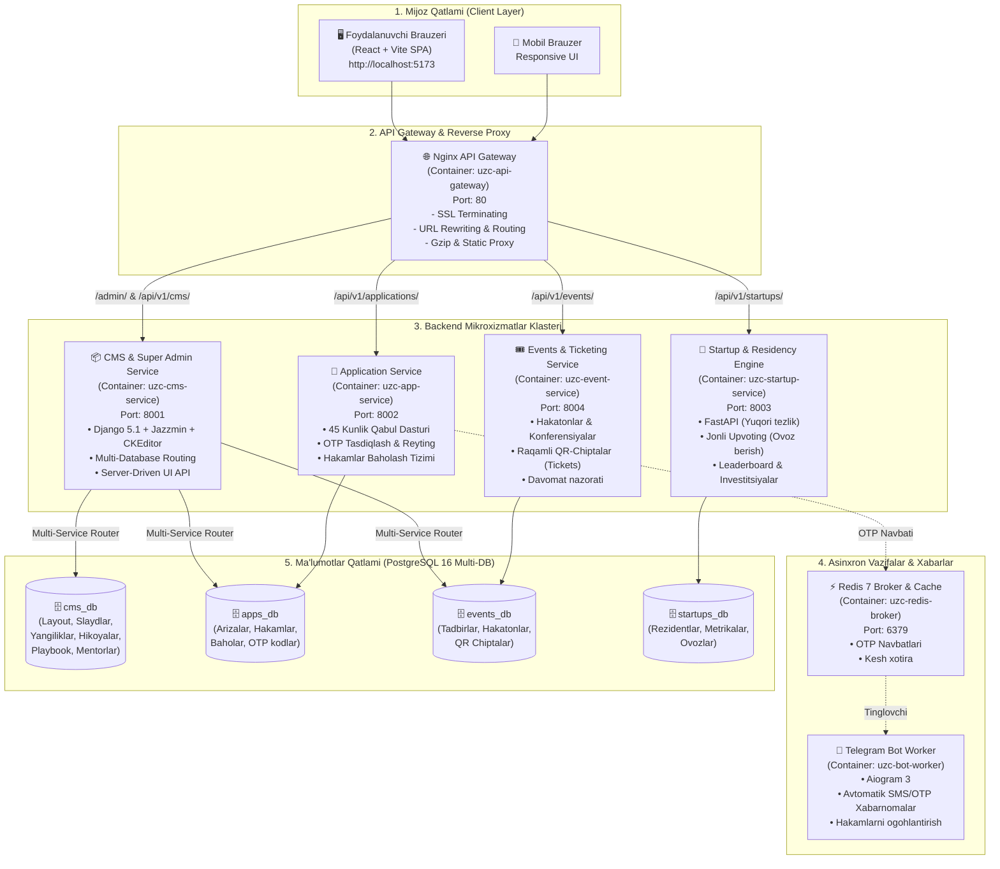

# UzCombinator NavDU — Startap Inkubatsiya & Akseleratsiya Platformasi

<div align="center">


**Navoiy davlat universiteti (NavDU) talabalari, tadqiqotchilari va startap jamoalari uchun yaratilgan to‘liq taqsimlangan mikroxizmatlar (microservices) ekotizimi.**

[Loyiha Arxitekturasi](#-butun-tizim-arxitekturasi-va-infratuzilma) •
[Backend Xizmatlari](#-backend-mikroxizmatlari-va-imkoniyatlari) •
[Super Admin & Jazzmin](#-markaziy-super-admin-paneli--jazzmin) •
[Avtomatik Slug & CKEditor](#-avtomatik-slug-va-ckeditor-tahrirlovchisi) •
[API Hujjatlari](#-api-marshrutlari-va-portlar) •
[O‘rnatish & Ishga tushirish](#-ornatish-va-ishga-tushirish-quick-start)

</div>

---

## 🏛️ Loyiha Haqida

**UzCombinator NavDU** — bu talabalar g‘oyalarini saralash, 45 kunlik intensiv akseleratsiyadan o‘tkazish, ularga mentor biriktirish, jamoa (co-founder) shakllantirish, hakatonlar va tadbirlarga QR-chiptalar tarqatish hamda investorlar oldidagi Demo Day taqdimotlarini boshqaruvchi yagona avtomatlashtirilgan raqamli platformadir.

Loyiha eng zamonaviy arxitektura tamoyillari asosida ishlab chiqilgan:
- **Mikroxizmatlar:** Har bir xizmat (Arizalar, CMS, Tadbirlar, Startaplar, Bot) mustaqil Docker konteynerlarida ishlaydi.
- **Server-Driven UI:** Frontend tashqi ko‘rinishi, slayderlari, bo‘limlari va dinamik kontenti to‘liq markaziy backend CMS orqali boshqariladi.
- **Ko‘p bazali arxitektura (Multi-Database Routing):** Xavfsizlik va mustaqillikni ta’minlash maqsadida ma’lumotlar alohida PostgreSQL ma’lumotlar bazalariga ajratilgan.

---

## 🏗️ Butun Tizim Arxitekturasi va Infratuzilma

Quyidagi diagrammada brauzerdan tortib Nginx API Gateway, backend mikroxizmatlari, PostgreSQL klasteri va Redis brokerigacha bo‘lgan barcha bog‘lanishlar to‘liq ifodalangan:



---

## ⚙️ Backend Mikroxizmatlari va Imkoniyatlari

### 1. CMS & Super Admin Service (`uzc-cms-service` :8001)
- **Texnologiyalar:** Python 3.11, Django 5.1, Django REST Framework, Django-Jazzmin, Django-CKEditor.
- **Vazifasi:** Butun platformaning markaziy yuragi. Frontend Server-Driven UI tartibini boshqaradi, yagona Super Admin portalini taqdim etadi.
- **Ko‘p bazali router (`MultiServiceRouter`):**
  Ushbu maxsus router barcha servislar ma’lumotlar bazalarini bitta super admin panelida birlashtiradi:
  ```python
  route_app_labels = {
      'applications': 'apps_db',
      'events': 'events_db',
  }
  ```
  Super admin `http://localhost/admin/` ga kirganda, arizalarni tahrirlasa `apps_db` ga, tadbirlarni tahrirlasa `events_db` ga, yangiliklar va slaydlar esa `cms_db` ga yoziladi.

### 2. Application Service (`uzc-app-service` :8002)
- **Texnologiyalar:** Django 5.1, DRF, Celery/Redis client.
- **Vazifasi:** 45 kunlik inkubatsiya dasturiga arizalarni qabul qilish (`NAV-2026-XXXX`), Telegram orqali 6 xonali OTP kod yuborib tasdiqlash, ekspertlar va hakamlar hay’ati uchun baholash varaqlari (G‘oya, Jamoa, Bozor mezonlari bo‘yicha 1-10 ball).

### 3. Startup & Leaderboard Engine (`uzc-startup-service` :8003)
- **Texnologiyalar:** FastAPI, Pydantic, Uvicorn, SQLAlchemy/asyncpg.
- **Vazifasi:** Rezident startaplar ro‘yxati, jalb qilingan investitsiyalar hajmi (`$975,000+`), jamoalar profillari va real vaqtda ovoz berish (Upvote) API si.

### 4. Events & Ticketing Service (`uzc-event-service` :8004)
- **Texnologiyalar:** Django 5.1, DRF.
- **Vazifasi:** Universitet hakatonlari (masalan: *NavDU InnoHack 2026*), master-klasslar va Demo Day tadbirlarini boshqarish. Foydalanuvchilarga unikal raqamli QR-chiptalar generatsiya qilish va eshikda skaner qilib davomatni belgilash.

### 5. Telegram Bot Worker (`uzc-bot-worker`)
- **Texnologiyalar:** Python, Aiogram 3, Redis Pub/Sub.
- **Vazifasi:** Yangi ariza tushganda yoki holati o‘zgarganda (qabul qilindi, intervyuga chaqirildi) talabaga Telegram orqali bildirishnoma yuborish, OTP kodlarni yetkazish.

---

## 🎨 Markaziy Super Admin Paneli — Jazzmin

Admin paneli standart zerikarli ko‘rinishdan to‘liq xalos etilib, **Django Jazzmin** kutubxonasi yordamida zamonaviy korporativ portal darajasiga keltirildi:

- **Kirish manzili:** `http://localhost/admin/` (`admin` / `admin123`).
- **Mavzu va ranglar:** `Flatly` mavzusi, qorong‘u va yorug‘ rejimlar, yuqori navigatsiya paneli (`Bosh Sahifa`, `Arizalar`, `Hakatonlar`, `Startaplar`).
- **15 ta to‘liq integratsiyalashgan model:**
  1. `HeroSlide` — Bosh sahifa asosiy slaydlarini boshqarish.
  2. `SectionConfig` — Sayt bloklarining tartibi va ko‘rinishini sozlash.
  3. `TopTicker` — Sayt tepasidagi qizil e’lonlar ticker banneri.
  4. `PlatformMetric` — Jalb qilingan sarmoya va startaplar statistikasi.
  5. `PartnerLogo` — Hamkorlar (NKMK, IT Park, Yoshlar ishlari) karuseli.
  6. `Startup` — Rezident startaplar katalogi.
  7. `NewsArticle` — Yangiliklar va press-relizlar.
  8. `Mentor` — Mentorlar, sohalari va qabul vaqtlari.
  9. `CoFounderVacancy` — Hammuassis (Talent Pool) vakansiyalari.
  10. `Story` — Muvaffaqiyat hikoyalari va asoschilar intervyusi.
  11. `PlaybookGuide` — Startup Playbook amaliy qo‘llanmalari.
  12. `Application` — 45 kunlik dastur arizalari.
  13. `ApplicationEvaluation` — Hakamlar baholash varaqlari.
  14. `Event` — Hakatonlar va tadbirlar taqvimi.
  15. `Ticket` — Ishtirokchilarning elektron chiptalari va davomati.
- **Interaktiv HTML jadvallar:** Telefon/Telegramga bosganda to‘g‘ridan-to‘g‘ri ochiluvchi havolalar, Pitch Deck tugmalari, rangli status nishonlari (Badges).

---

## 🔗 Avtomatik Slug va CKEditor Tahrirlovchisi

### 1. Universal O‘zbek & Kirill SEO Slug Mexanizmi
Tizimda yaratiladigan har qanday yangilik, startap, tadbir yoki qo‘llanma uchun slug **sarlavhadan avtomatik, toza va takrorlanmas** qilib shakllantiriladi:
- `apps/common/slug_utils.py` da maxsus transliteratsiya algoritmi:
  - O‘zbek harflari: `o‘`, `g‘`, `o'`, `g'` $\rightarrow$ `o`, `g`.
  - Tutuq belgilari: `ta'lim` $\rightarrow$ `talim`, `san'at` $\rightarrow$ `sanat` *(keraksiz defislarsiz)*.
  - Kirill alifbosi: `ў` $\rightarrow$ `o`, `ғ` $\rightarrow$ `g`, `қ` $\rightarrow$ `q`, `ҳ` $\rightarrow$ `h`, `ч` $\rightarrow$ `ch`, `ш` $\rightarrow$ `sh`.
  - Raqamlar: `$1,000` $\rightarrow$ `1000`.
- Takroriy sarlavhalar kiritilganda bazada avtomatik `-1`, `-2` indekslash yo‘li bilan xatoliklar oldi olinadi.
- Django Admin oynasida sarlavha terilayotganda slug maydoni real vaqt rejimida avtomatik to‘lib boradi (`prepopulated_fields`).

### 2. CKEditor (WYSIWYG Rich-Text Editor)
Barcha modellarning katta matn kiritish darchalari (`models.TextField`) to‘liq quvvatli **CKEditor** bilan jihozlandi:
- Sarlavhalar (H1, H2, H3, H4, Paragraph), Shriftlar va Shrift o‘lchamlari.
- HTML Source kodini to‘g‘ridan-to‘g‘ri ko‘rish va tahrirlash.
- Butun ekranga ochish (Maximize / Fullscreen).
- Matn va fon ranglari, Qalin, Kursiv, Ro‘yxatlar, Xatboshini surish.
- Moslashuvchan jadvallar (Tables), Rasm kiritish, Veb-havolalar, Iqtiboslar (Blockquote) va Kod bloklari (`codesnippet`).
- Frontend (`NewsDetailPage.tsx`, `StoryDetailPage.tsx`) ushbu formatlangan boyitilgan HTML ni xatosiz vizual chizib beradi.

---

## 📡 API Marshrutlari va Portlar

| Marshrut (Endpoint) | Metod | Qaysi Servis | Vazifasi |
| :--- | :---: | :--- | :--- |
| `http://localhost/` | `GET` | Vite Frontend | Saytning asosiy sahifasi (SPA) |
| `http://localhost/admin/` | `GET/POST` | CMS Service | Yagona Markaziy Super Admin Paneli |
| `/api/v1/cms/layout/` | `GET` | CMS Service | Butun sahifa tartibi, slaydlar, yangiliklar (Server-Driven UI) |
| `/api/v1/cms/news/` | `GET` | CMS Service | Yangiliklar va maqolalar ro‘yxati |
| `/api/v1/cms/mentors/` | `GET` | CMS Service | Mentorlar va ularning bandlik vaqtlari |
| `/api/v1/cms/vacancies/` | `GET` | CMS Service | Hammuassis va mutaxassis vakansiyalari |
| `/api/v1/cms/stories/` | `GET` | CMS Service | Startapchilar hikoyalari |
| `/api/v1/cms/guides/` | `GET` | CMS Service | Startup Playbook bo‘limlari |
| `/api/v1/applications/apply/` | `POST` | App Service | Akseleratsiyaga yangi ariza topshirish |
| `/api/v1/applications/status/`| `POST` | App Service | Tracking kod bo‘yicha ariza holatini bilish |
| `/api/v1/applications/verify-otp/` | `POST` | App Service | Telegram OTP kodni tasdiqlash |
| `/api/v1/startups/` | `GET` | Startup Service | Rezident startaplar katalogi |
| `/api/v1/startups/{id}/upvote` | `POST` | Startup Service | Startapga ovoz berish (Upvote) |
| `/api/v1/events/list/` | `GET` | Event Service | Hakatonlar va ochiq tadbirlar |
| `/api/v1/events/{id}/register/`| `POST` | Event Service | Tadbirga ro‘yxatdan o‘tib QR chipta olish |

---

## 💻 Frontend Arxitekturasi

- **Asosiy Stack:** React 18, Vite 8, TypeScript 5.5, Tailwind CSS 3.4.
- **Vizual Dizayn:** Warm Cream (`#fbf9f5`) foni, suzib yuruvchi **Aurora ambient** gradient sharlari, to‘liq moslashuvchan (Responsive) mobil va desktop interfeys.
- **Dinamik integratsiya:** Bosh sahifa slaydlaridan tortib, e’lonlar va hamkorlar logotiplarigacha barchasi backenddagi o‘zgarishlarga qarab dinamik tarzda o‘zgaradi.
- **Tezkor build:** `npm run build` atigi 800-900ms ichida 100% xatosiz kompilyatsiya bo‘ladi.

---

## 🚀 O‘rnatish va Ishga Tushirish (Quick Start)

### Talablar:
- **Docker** va **Docker Compose**
- **Node.js** (v18+) va **npm**
- **Git**

### 1. Repozitoriyni klonlash:
```bash
git clone https://github.com/cipher-edu/NSU-combinator.git
cd NSU-combinator
```

### 2. Docker mikroxizmatlarini ishga tushirish:
```bash
docker compose up -d --build
```
*Barcha 8 ta konteyner avtomatik ko‘tariladi va PostgreSQL ma’lumotlar bazalari sozlanadi.*

### 3. Ma’lumotlar bazalarini migratsiya qilish va statik fayllarni yig‘ish:
```bash
docker exec uzc-cms-service python manage.py migrate
docker exec uzc-app-service python manage.py migrate
docker exec uzc-event-service python manage.py migrate
docker exec uzc-cms-service python manage.py collectstatic --noinput
```

### 4. Frontendni ishga tushirish:
```bash
npm install
npm run dev
```

Brauzer orqali oching:
- **Veb-sayt:** [http://localhost:5173](http://localhost:5173)
- **Super Admin Paneli:** [http://localhost/admin/](http://localhost/admin/) *(Login: `admin`, Parol: `admin123`)*

---

## 📁 Loyiha Kataloglar Tuzilishi

```text
├── gateway/                    # Nginx API Gateway konfiguratsiyalari
│   └── nginx.conf              # Yagona port (80) orqali proksi marshrutlash
├── services/                   # Backend Mikroxizmatlar
│   ├── cms_service/            # CMS, Slaydlar, Layout va Yagona Super Admin (Django)
│   ├── application_service/    # 45 Kunlik arizalar va OTP xizmati (Django)
│   ├── startup_service/        # Startaplar katalogi va Upvoting (FastAPI)
│   ├── event_service/          # Hakatonlar, seminarlar va QR chiptalar (Django)
│   └── bot_worker/             # Telegram bildirishnoma va OTP boti (Aiogram)
├── src/                        # Frontend Manba Kodi (React + TypeScript)
│   ├── api/                    # Backend bilan ishlovchi API modullari
│   ├── components/             # Qayta ishlatiluvchi UI komponentlar
│   ├── pages/                  # Ichki sahifalar (News, Stories, Events, Mentors)
│   ├── types/                  # TypeScript interfeyslari
│   └── data/                   # Dastlabki lokal ma'lumotlar
├── docker-compose.yml          # Barcha 8 ta konteynerni boshqaruvchi fayl
├── HISTORY.md                  # Loyiha o'zgarishlarining to'liq tarixi (Changelog)
└── README.md                   # Asosiy texnik hujjat (Siz shu yerdasiz)
```

---

<div align="center">
  <b>Navoiy Davlat Universiteti • UzCombinator Ekotizimi 2026</b><br/>
  <i>Muallif va Ishlab chiquvchi: <a href="https://github.com/cipher-edu">cipher-edu</a></i>
</div>
